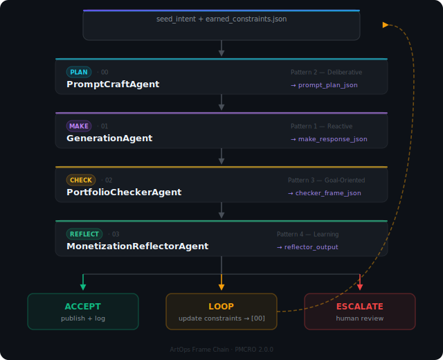

# Agent Reference

ArtOps consists of four phase-isolated agents. Each agent owns exactly one phase of the cognitive loop. No agent crosses its phase boundary. All inter-agent state moves as typed JSON frames — no prose crosses agent boundaries.

---

## The Frame Chain

  

---

## Agent Summary

| # | Agent | Phase | Pattern | Input | Output |
|---|---|---|---|---|---|
| 00 | [PromptCraftAgent](00-prompt-craft-agent.md) | PLAN | 2 — Deliberative | `seed_intent` + constraints | `prompt_plan_json` |
| 01 | [GenerationAgent](01-generation-agent.md) | MAKE | 1 — Reactive | `prompt_plan_json` + photo | `make_response_json` |
| 02 | [PortfolioCheckerAgent](02-portfolio-checker-agent.md) | CHECK | 3 — Goal-Oriented | `make_response_json` + brand profile | `checker_frame_json` |
| 03 | [MonetizationReflectorAgent](03-monetization-reflector-agent.md) | REFLECT | 4 — Learning | `checker_frame_json` | `reflector_output` |

---

## Phase Isolation Law

Each agent is constitutionally restricted to its phase. Violations of phase isolation are treated as critical errors.

| Agent | Does | Never Does |
|---|---|---|
| PromptCraftAgent | Plans prompt variants from concept + constraints | Generates images · scores output · issues verdicts |
| GenerationAgent | Executes prompts on image generator · records raw results | Plans · summarizes · scores · issues verdicts |
| PortfolioCheckerAgent | Scores variants across 10 dimensions · issues PASS/FAIL per variant | Plans · generates · issues verdicts |
| MonetizationReflectorAgent | Issues verdict · writes earned constraints · prepares publish payload | Plans · generates · scores |

---

## Cognitive Patterns

Each agent uses the cognitive pattern best suited to its job:

| Pattern | Name | Characteristic | Assigned Agent |
|---|---|---|---|
| Pattern 1 | Reactive | Fast, input-driven, minimal deliberation | GenerationAgent |
| Pattern 2 | Deliberative | Slow, exploratory, hypothesis-generating | PromptCraftAgent |
| Pattern 3 | Goal-Oriented | State-comparing, threshold-checking | PortfolioCheckerAgent |
| Pattern 4 | Learning | Verdict-issuing, constraint-writing | MonetizationReflectorAgent |

---

## Scorer Rubric (PortfolioCheckerAgent)

The CHECK phase scores each variant across ten dimensions. Each dimension is worth 0–4 points. Maximum total: 40 points.

| Dimension | Max | Notes |
|---|---|---|
| Technical quality | 4 | Resolution, sharpness, no artifacts |
| Composition | 4 | Rule-of-thirds, focal point, negative space |
| Lighting | 4 | Consistency, drama, source realism |
| Color harmony | 4 | Palette coherence, mood match |
| Subject authenticity | 4 | Subject's actual appearance recognizable |
| Brand consistency | 4 | Matches `brand-profile.json` signals — **scored 0 without reference photo** |
| Style execution | 4 | Intended aesthetic correctly applied |
| Emotional resonance | 4 | Intended mood conveyed |
| Marketability | 4 | Would buyers engage with this on Dribbble/Adobe Stock? |
| Innovation | 4 | Novel, distinguishable from generic AI output |
| **Total** | **40** | **Pass threshold: ≥ 28 AND brand_consistency > 0** |

---

## Version Information

| Agent | Version | ThoughtLock | Pattern |
|---|---|---|---|
| PromptCraftAgent | 2.0.0 | 2026-06-12 | 2 — Deliberative |
| GenerationAgent | 2.0.0 | 2026-06-12 | 1 — Reactive |
| PortfolioCheckerAgent | 2.0.0 | 2026-06-12 | 3 — Goal-Oriented |
| MonetizationReflectorAgent | 2.0.0 | 2026-06-12 | 4 — Learning |
