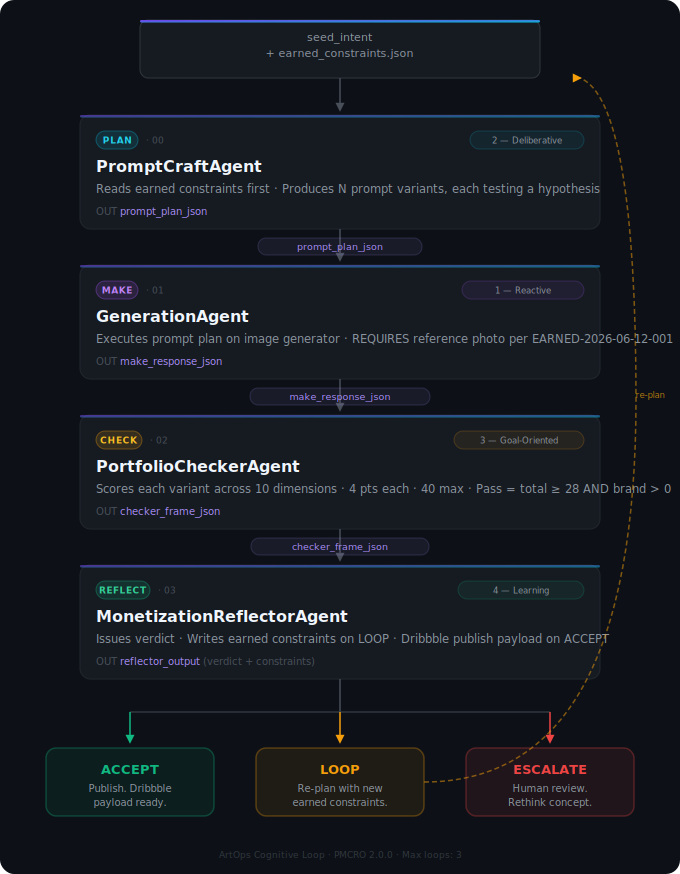
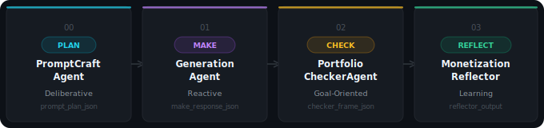

<div class="hero-banner">
  <div class="hero-badge">v1.0.5 &nbsp;·&nbsp; PMCRO 2.0.0 &nbsp;·&nbsp; DocFX 2.78.5</div>
  <h1 class="hero-title">ArtOps</h1>
  <p class="hero-sub">A four-agent cognitive loop for AI self-portrait art.<br>Plan prompts. Generate images. Check portfolio quality. Reflect and monetize.<br>Runs on any AI platform.</p>
  <div class="hero-ctas">
    <a class="btn-cta btn-cta-primary" href="articles/guides/getting-started.md">Get Started →</a>
    <a class="btn-cta btn-cta-ghost" href="articles/agents/index.md">Agent Reference</a>
    <a class="btn-cta btn-cta-ghost" href="https://github.com/ShawnDelaineBellazanLoop/artops-portable" target="_blank">View on GitHub ↗</a>
  </div>
</div>

<div class="stat-grid">
  <div class="stat-item">
    <span class="stat-number">4</span>
    <span class="stat-label">Agents</span>
  </div>
  <div class="stat-item">
    <span class="stat-number">40</span>
    <span class="stat-label">Max Score</span>
  </div>
  <div class="stat-item">
    <span class="stat-number">28</span>
    <span class="stat-label">Pass Threshold</span>
  </div>
  <div class="stat-item">
    <span class="stat-number">3</span>
    <span class="stat-label">Max Loops</span>
  </div>
</div>

## What is ArtOps?

ArtOps is a **portable agent skill pack** built on the PMCRO framework. It structures the messy, iterative process of AI art generation into four discrete, phase-isolated agents — each with a typed input contract, a typed output contract, and a cognitive pattern that matches its job.

The pack is not a tool. It is a **cognitive protocol** — load each agent's `SKILL.md` into any capable AI platform, carry JSON frames between agents, and the loop does the rest.

| Metric | Value |
|---|---|
| Agents | 4 |
| Phases | PLAN → MAKE → CHECK → REFLECT |
| Pass threshold | ≥ 28 / 40 total score |
| Max loops | 3 (EC-009 enforced) |
| Framework | PMCRO 2.0.0 · MAF 1.10.0 · MCP 1.4.0 |
| Skill files | `skills/` directory |

---

## The Loop



---

## The Four Agents



<div class="agent-grid">
  <a class="agent-card" href="articles/agents/00-prompt-craft-agent.md">
    <div class="card-number">00 · PLAN</div>
    <div class="card-title">PromptCraftAgent</div>
    <div class="card-phase-badge badge-plan">Deliberative</div>
    <div class="card-desc">Reads earned constraints first. Produces N distinct prompt variants, each testing a hypothesis. Never generates images.</div>
    <div class="card-io"><span class="io-label">IN</span> seed_intent + constraints &nbsp;·&nbsp; <span class="io-label">OUT</span> prompt_plan_json</div>
  </a>
  <a class="agent-card" href="articles/agents/01-generation-agent.md">
    <div class="card-number">01 · MAKE</div>
    <div class="card-title">GenerationAgent</div>
    <div class="card-phase-badge badge-make">Reactive</div>
    <div class="card-desc">Executes prompts on your image generator. Requires a reference photo. Records raw results without interpretation.</div>
    <div class="card-io"><span class="io-label">IN</span> prompt_plan_json + photo &nbsp;·&nbsp; <span class="io-label">OUT</span> make_response_json</div>
  </a>
  <a class="agent-card" href="articles/agents/02-portfolio-checker-agent.md">
    <div class="card-number">02 · CHECK</div>
    <div class="card-title">PortfolioCheckerAgent</div>
    <div class="card-phase-badge badge-check">Goal-Oriented</div>
    <div class="card-desc">Scores each variant across 10 dimensions (4 pts each). Issues PASS/FAIL per variant. Never issues verdicts.</div>
    <div class="card-io"><span class="io-label">IN</span> make_response_json + brand profile &nbsp;·&nbsp; <span class="io-label">OUT</span> checker_frame_json</div>
  </a>
  <a class="agent-card" href="articles/agents/03-monetization-reflector-agent.md">
    <div class="card-number">03 · REFLECT</div>
    <div class="card-title">MonetizationReflectorAgent</div>
    <div class="card-phase-badge badge-reflect">Learning</div>
    <div class="card-desc">The only agent authorized to issue a verdict. Writes earned constraints on LOOP. Prepares Dribbble payload on ACCEPT.</div>
    <div class="card-io"><span class="io-label">IN</span> checker_frame_json &nbsp;·&nbsp; <span class="io-label">OUT</span> verdict + constraints</div>
  </a>
</div>

---

## Earned Constraints

The loop learns. Every LOOP verdict crystallizes a new `never_again` rule that prevents the same mistake from recurring.

| ID | Rule | Source |
|---|---|---|
| `EARNED-2026-06-12-001` | Reference photo must be attached at generation time. Text-only generation produces `brand_consistency = 0`, making the score unpassable. | Chase session · Loop 1 · Score 24/40 · LOOP |

[Full constraint documentation →](articles/guides/earned-constraints.md)

---

## Quick Start

```bash
# 1. Clone the pack
git clone https://github.com/ShawnDelaineBellazanLoop/artops-portable
cd artops-portable

# 2. Fill in your brand profile
# Edit skills/brand-profile.json — add style keywords, color palette, avoid list

# 3. Open skills/00-prompt-craft-agent/SKILL.md in your AI platform
# Paste as system prompt, add skills/earned-constraints.json + your concept

# 4. Carry prompt_plan_json to GenerationAgent
# ATTACH a reference photo of your subject — required by EARNED-2026-06-12-001

# 5. Carry make_response_json to PortfolioCheckerAgent
# Include skills/brand-profile.json contents

# 6. Carry checker_frame_json to MonetizationReflectorAgent
# Act on verdict: ACCEPT → publish | LOOP → re-plan | ESCALATE → review
```

[Full step-by-step guide →](articles/guides/getting-started.md)

---

## Platform Compatibility

| Platform | PLAN (00) | MAKE (01) | CHECK (02) | REFLECT (03) |
|---|---|---|---|---|
| Google AI Studio | ✅ Gemini 2.5 Pro | — | ✅ | ✅ |
| Microsoft Copilot | ✅ | ✅ Image Creator | ✅ | ✅ |
| Claude (Anthropic) | ✅ | — | ✅ | ✅ |
| Gemini CLI | ✅ | — | ✅ | ✅ |
| Adobe Firefly | — | ✅ | — | — |
| DALL-E / GPT-4o | — | ✅ | — | — |

[Cross-platform workflow guide →](articles/guides/cross-platform.md)

---

## Stack

| Component | Version | Role |
|---|---|---|
| PMCRO | 2.0.0 | Cognitive loop orchestration framework |
| MAF | 1.10.0 | Multi-Agent Framework |
| MCP | 1.4.0 | Model Context Protocol |
| .NET | 10 LTS | Runtime |
| DocFX | 2.78.5 | Documentation site generator |

---

*ArtOps Portable v1.0.5 · Built on PMCRO 2.0.0 · Tooensure LLC · 2026*
